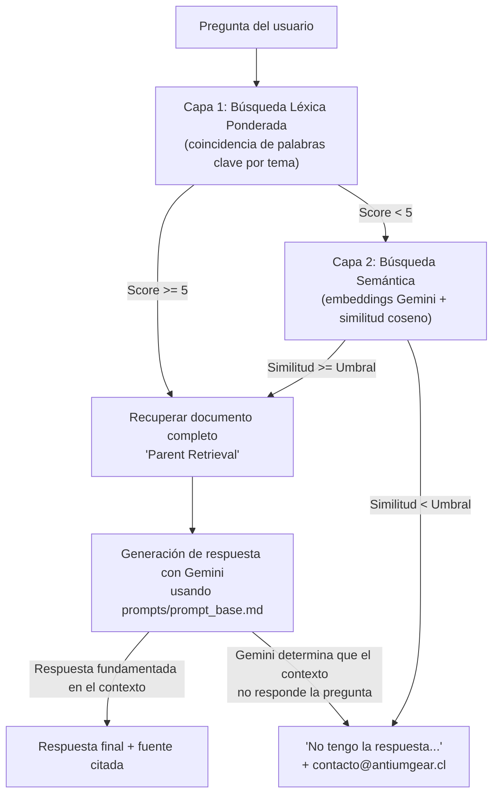
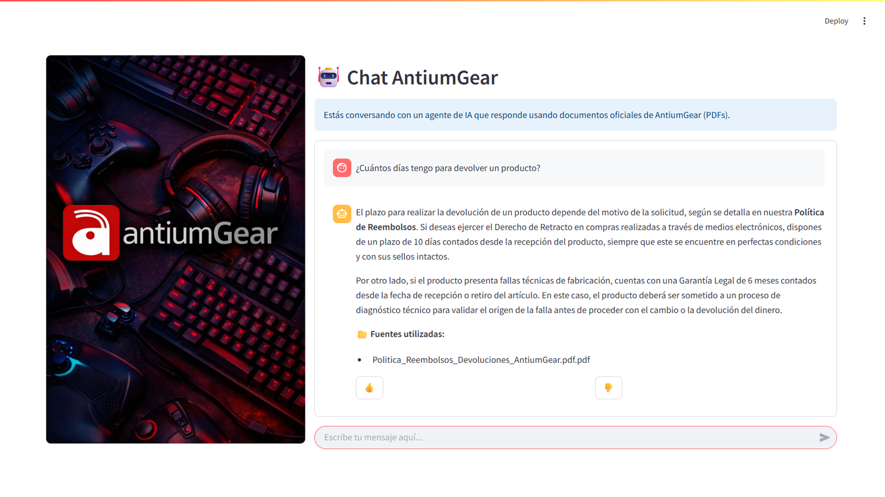
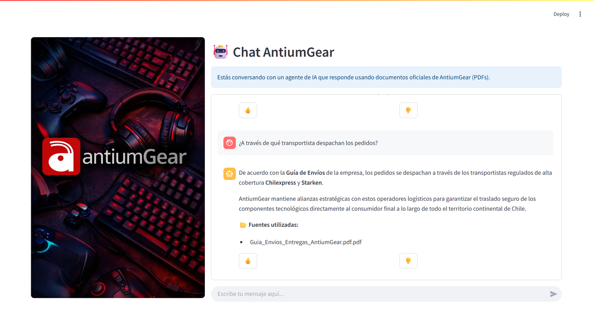
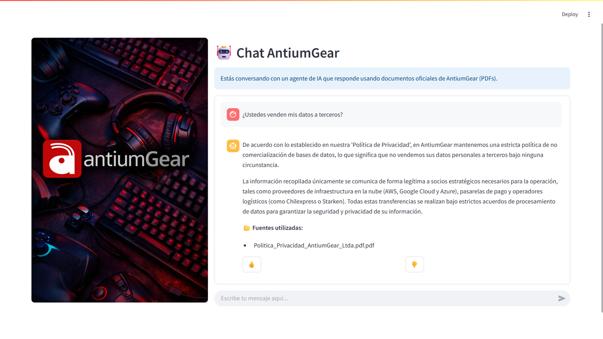
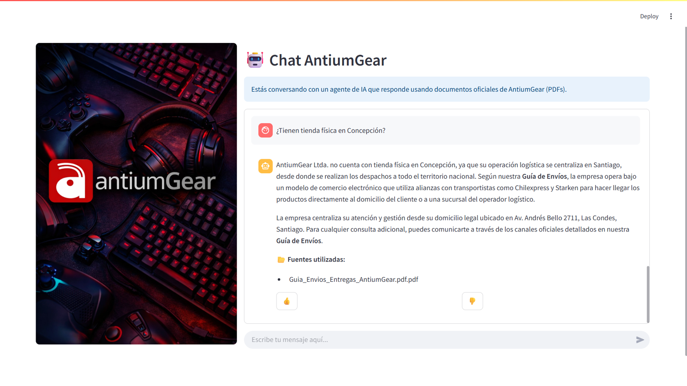
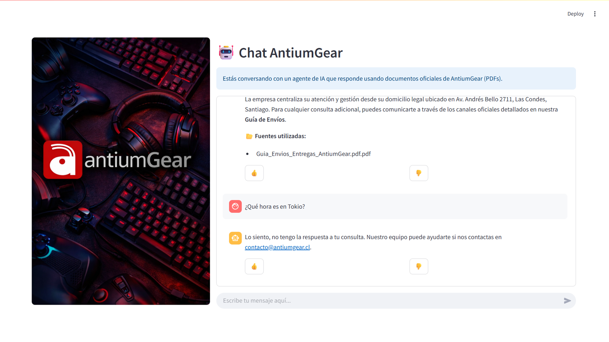

<p align="center">
  
</p>

# Agente de IA para AntiumGear 🤖🛠️

Proyecto desarrollado en el marco del programa **Oracle Next Education (ONE) — Tech AI Builder**, en alianza con Alura Latam.

Chatbot de atención al cliente para **AntiumGear**, empresa chilena de e-commerce dedicada a la importación, distribución y comercialización de productos computacionales. El agente responde preguntas de clientes basándose **exclusivamente** en los documentos oficiales de la empresa (políticas de reembolso, privacidad, términos y condiciones, y guía de envíos), evitando respuestas inventadas y derivando a soporte humano cuando no cuenta con información suficiente.

## 🚀 Características principales

- **Arquitectura RAG en dos capas:** combina búsqueda léxica ponderada por tema y búsqueda semántica por embeddings, priorizando siempre la coincidencia más confiable disponible.
- **Búsqueda léxica ponderada:** clasifica cada pregunta contra un diccionario de temas (reembolsos, privacidad, envíos, términos) validando que la palabra clave coincida tanto en la pregunta como en el documento correcto, evitando falsos cruces entre PDFs.
- **Búsqueda semántica con embeddings de Gemini:** usada como respaldo cuando la búsqueda léxica no es concluyente, con `task_type` diferenciado (`RETRIEVAL_QUERY` / `RETRIEVAL_DOCUMENT`) para mejorar la precisión de la similitud coseno entre preguntas y documentos.
- **Caché persistente de embeddings:** los vectores se guardan en disco para no recalcularlos en cada consulta, reduciendo latencia y consumo de cuota de la API.
- **Selección dinámica de modelo:** consulta los modelos Gemini disponibles en la cuenta y elige automáticamente el más adecuado, con una cadena de modelos de respaldo si el principal falla.
- **Guardrail anti-alucinación:** si ninguna capa de búsqueda supera su umbral de confianza, o si el propio modelo determina que el contexto no responde la pregunta, el sistema deriva a soporte humano **sin citar ninguna fuente falsa**.
- **Interfaz de chat:** aplicación para usuario final con Streamlit, con manejo de sesión, visualización de fuentes citadas y sistema de feedback (👍/👎).

## 🛠️ Tecnologías utilizadas

- **Lenguaje:** Python 3.10+
- **LLM y embeddings:** Google Gemini API (`google-generativeai`) — generación con `gemini-3.5-flash` (con cadena de fallback), embeddings con `gemini-embedding-001` / `gemini-embedding-2`
- **Extracción de PDF:** PyPDF2
- **Cálculo numérico:** NumPy (similitud coseno)
- **Interfaz:** Streamlit
- **Utilidades:** python-dotenv
- **Persistencia de caché:** JSON

> **Nota:** el proyecto usa actualmente el paquete `google-generativeai`, que Google ha marcado como discontinuado en favor de `google-genai`. Sigue funcionando correctamente; está planificada una migración al SDK nuevo.

## 📋 Requisitos previos

Necesitarás lo siguiente configurado en tu entorno:

1. Python 3.10 o superior.
2. Una API key de Google AI Studio, configurada en un archivo `.env` en la raíz del proyecto:
   ```
   GOOGLE_API_KEY=tu_api_key_aqui
   ```

## 🔧 Instalación

```bash
git clone https://github.com/GitNonoRamirez/<nombre-del-repo>.git
cd Proyecto-Alura-antiumGear-

python -m venv venv
venv\Scripts\activate        # Windows (PowerShell)
# source venv/bin/activate   # Linux / macOS

pip install -r requirements.txt
```

## ▶️ Comandos de uso

```bash
# 1) Prueba rápida por consola (sin interfaz gráfica)
python app/buscador.py

# 2) Ejecutar la aplicación completa (interfaz de chat)
streamlit run app/app_streamlit.py
```

## 🗂️ Arquitectura de la solución

El sistema implementa un pipeline de **RAG (Retrieval-Augmented Generation)** de dos capas de búsqueda, con generación de respuesta a cargo de un modelo Gemini.



1. **Ingesta de documentos:** los PDFs de `documentos/` se leen con PyPDF2, se extrae el texto por página y se segmentan en chunks de ~1000 palabras con 200 de solapamiento, preservando además el texto completo de cada documento.
2. **Capa 1 — Búsqueda léxica ponderada:** la pregunta se normaliza (minúsculas, sin tildes) y se compara contra un diccionario de temas, cada uno con su propia lista de palabras clave. Si el puntaje alcanza el umbral mínimo, se usa ese documento directamente.
3. **Capa 2 — Búsqueda semántica (fallback):** si la Capa 1 no encuentra una coincidencia suficientemente fuerte, se generan embeddings con Gemini (con `task_type` diferenciado para pregunta y documentos) y se calcula similitud coseno. Solo se acepta una coincidencia si supera el umbral de confianza configurado.
4. **Generación de la respuesta:** el documento completo recuperado se entrega como contexto a Gemini, junto con una plantilla de prompt externa (`prompts/prompt_base.md`) que instruye al modelo a responder únicamente en base a ese contexto.
5. **Guardrail anti-alucinación:** si ninguna capa supera su umbral, o si el modelo determina que el contexto no responde la pregunta, se devuelve un mensaje estándar derivando a soporte humano, sin citar fuente.

### 📁 Estructura del proyecto

```
Proyecto-Alura-antiumGear-/
├── app/
│   ├── app_streamlit.py       # Interfaz web (Streamlit)
│   ├── buscador.py            # Motor de búsqueda y generación (RAG)
│   ├── feedback.py            # Registro de feedback de usuarios
│   ├── feedback.csv           # Datos de feedback
│   ├── fuentes.py             # Visualización de fuentes citadas
│   ├── session_manager.py     # Manejo de sesión de Streamlit
│   └── embeddings_cache.json  # Caché local de embeddings (se autogenera)
├── documentos/                 # Base de conocimiento (PDFs oficiales)
│   ├── Politica_Reembolsos_Devoluciones_AntiumGear.pdf
│   ├── Politica_Privacidad_AntiumGear_Ltda.pdf
│   ├── Terminos_Condiciones_AntiumGear.pdf
│   └── Guia_Envios_Entregas_AntiumGear.pdf
├── prompts/
│   └── prompt_base.md          # Plantilla de prompt para Gemini
├── .env                         # Variables de entorno (no versionar)
└── requirements.txt
```

# 💬 Ejemplos de preguntas y respuestas

## Ejemplo 1

### Pregunta
> ¿Cuántos días tengo para devolver un producto?

### Respuesta

**Fuentes utilizadas:** `Politica_Reembolsos_Devoluciones_AntiumGear.pdf.pdf`

El plazo para realizar la devolución de un producto depende del motivo de la solicitud, según se detalla en nuestra Política de Reembolsos. Si deseas ejercer el Derecho de Retracto en compras realizadas a través de medios electrónicos, dispones de un plazo de 10 días contados desde la recepción del producto, siempre que este se encuentre en perfectas condiciones y con sus sellos intactos.

Por otro lado, si el producto presenta fallas técnicas de fabricación, cuentas con una Garantía Legal de 6 meses contados desde la fecha de recepción o retiro del artículo. En este caso, el producto deberá ser sometido a un proceso de diagnóstico técnico para validar el origen de la falla antes de proceder con el cambio o la devolución del dinero.



## Ejemplo 2

### Pregunta
> ¿A través de qué transportista despachan los pedidos?

### Respuesta

**Fuentes utilizadas:** `Guia_Envios_Entregas_AntiumGear.pdf.pdf`

De acuerdo con la Guía de Envíos de la empresa, los pedidos se despachan a través de los transportistas regulados de alta cobertura Chilexpress y Starken.

AntiumGear mantiene alianzas estratégicas con estos operadores logísticos para garantizar el traslado seguro de los componentes tecnológicos directamente al consumidor final a lo largo de todo el territorio continental de Chile.



## Ejemplo 3

### Pregunta
> ¿Ustedes venden mis datos a terceros?

### Respuesta

**Fuentes utilizadas:** `Politica_Privacidad_AntiumGear_Ltda.pdf.pdf`

De acuerdo con lo establecido en nuestra 'Política de Privacidad', en AntiumGear mantenemos una estricta política de no comercialización de bases de datos, lo que significa que no vendemos sus datos personales a terceros bajo ninguna circunstancia.

La información recopilada únicamente se comunica de forma legítima a socios estratégicos necesarios para la operación, tales como proveedores de infraestructura en la nube (AWS, Google Cloud y Azure), pasarelas de pago y operadores logísticos (como Chilexpress o Starken). Todas estas transferencias se realizan bajo estrictos acuerdos de procesamiento de datos para garantizar la seguridad y privacidad de su información.



## Ejemplo 4 — Respuesta razonada a partir del contexto

### Pregunta
> ¿Tienen tienda física en Concepción?

### Respuesta

*Esta pregunta no está respondida literalmente en ningún documento — el agente construye la respuesta razonando sobre el modelo operativo descrito en la Guía de Envíos.*

**Fuentes utilizadas:** `Guia_Envios_Entregas_AntiumGear.pdf.pdf`

AntiumGear Ltda. no cuenta con tienda física en Concepción, ya que su operación logística se centraliza en Santiago, desde donde se realizan los despachos a todo el territorio nacional. Según nuestra Guía de Envíos, la empresa opera bajo un modelo de comercio electrónico que utiliza alianzas con transportistas como Chilexpress y Starken para hacer llegar los productos directamente al domicilio del cliente o a una sucursal del operador logístico.

La empresa centraliza su atención y gestión desde su domicilio legal ubicado en Av. Andrés Bello 2711, Las Condes, Santiago. Para cualquier consulta adicional, puedes comunicarte a través de los canales oficiales detallados en nuestra Guía de Envíos.



## Ejemplo 5 — Pregunta fuera de alcance

### Pregunta
> ¿Qué hora es en Tokio?

### Respuesta

**Fuentes utilizadas:** Ninguna — la pregunta no supera el umbral de confianza en ninguna de las dos capas de búsqueda, y el guardrail evita mostrar una fuente cuando no se usó ninguna.

Lo siento, no tengo la respuesta a tu consulta. Nuestro equipo puede ayudarte si nos contactas en contacto@antiumgear.cl.



## 🌐 Despliegue
 
La aplicación está desplegada y disponible públicamente en Streamlit Community Cloud:
 
🔗 **[https://antiumgear-chatbot.streamlit.app/](https://antiumgear-chatbot.streamlit.app/)**
 
Cualquier persona puede acceder al link y probar el chatbot directamente, sin necesidad de instalar nada localmente.

---

## Estado actual y próximos pasos

- Migrar de `google.generativeai` (discontinuado) al SDK `google.genai`.
- Ajustar y monitorear el umbral de confianza de la búsqueda semántica a medida que se agreguen nuevos documentos.
- Ampliar la base de conocimiento con más documentos oficiales.

## Autor

**Alfredo Ramírez** ([@GitNonoRamirez](https://github.com/GitNonoRamirez)) — Proyecto desarrollado como parte del programa Oracle Next Education (ONE) — Tech AI Builder.